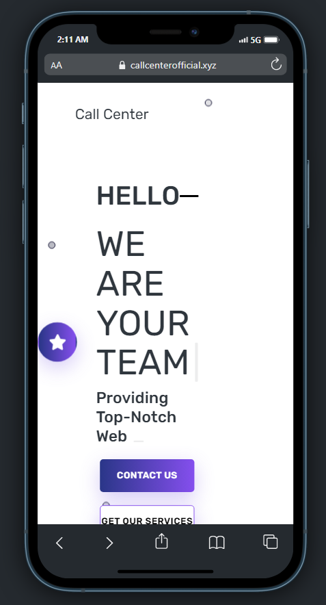
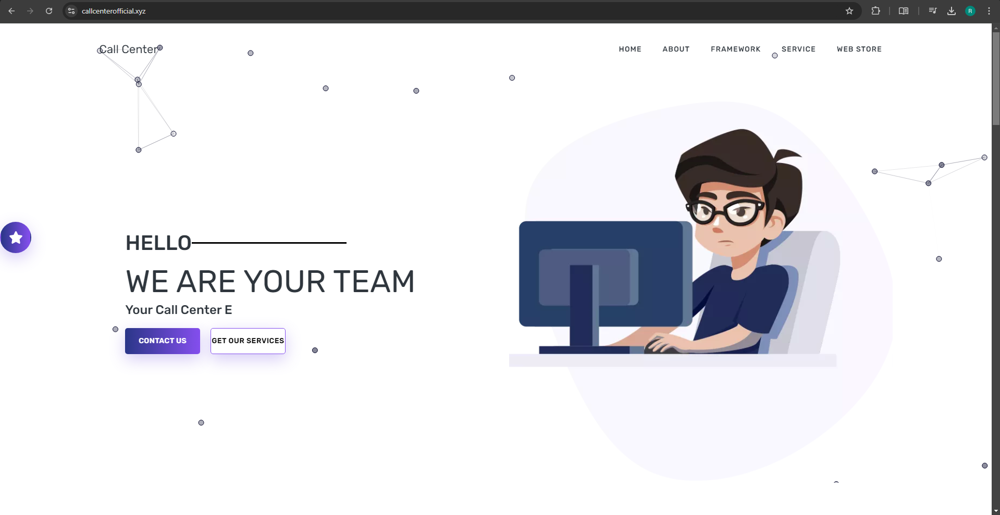

# Developer Portfolio Template

## Description

The Developer Portfolio Template is a customizable and responsive template designed for showcasing your professional skills and projects as a developer. It provides an elegant and user-friendly interface that is suitable for both mobile and desktop views.

## Screenshots

### Mobile View


### Desktop View



<video width="320" height="240" controls>
  <source src="./assets/preview.mp4" type="video/mp4">
  Your browser does not support the video tag.
</video>


## Features

- Fully customizable: You can easily personalize the template to match your preferences and branding.
- Responsive design: The template is optimized to work seamlessly on various devices, ensuring a consistent user experience.
- User-friendly interface: The intuitive layout makes it simple to navigate and showcase your skills and projects effectively.


# Developer Portfolio Template

This project is a Developer Portfolio Template designed to showcase your professional skills and projects as a developer. It provides a customizable and responsive interface suitable for both mobile and desktop views.

## Getting Started

To get started with the Developer Portfolio Template, follow these steps:

1. Clone the repository:
   ```
   git clone https://github.com/kyy-95631488/CallCenter
   ```

2. Navigate to the project directory:
   ```
   cd CallCenter
   ```

3. Install the dependencies:
   ```
   npm install
   ```

4. Customize the template:
   - Modify the content, colors, and layout according to your preferences.
   - Add your projects and update the portfolio section.

5. Start the development server:
   ```
   npm start
   ```

6. Open [http://localhost:3000](http://localhost:3000) in your browser to view the template.

## Features

- Fully customizable: Easily personalize the template to match your branding and style.
- Responsive design: The template is optimized for various devices, ensuring a consistent user experience.
- User-friendly interface: Intuitive layout and navigation make it simple to showcase your skills and projects effectively.

## Contributing

Contributions are welcome! If you have any suggestions, bug reports, or feature requests, please open an issue or submit a pull request.


## Contact

For any inquiries or support, please feel free to reach out:

- CallCenter
- Email: cerberus404x@gmail.com
- GitHub: [kyy-95631488](https://github.com/kyy-95631488)

Enjoy using the Developer Portfolio Template to showcase your work and skills professionally!
